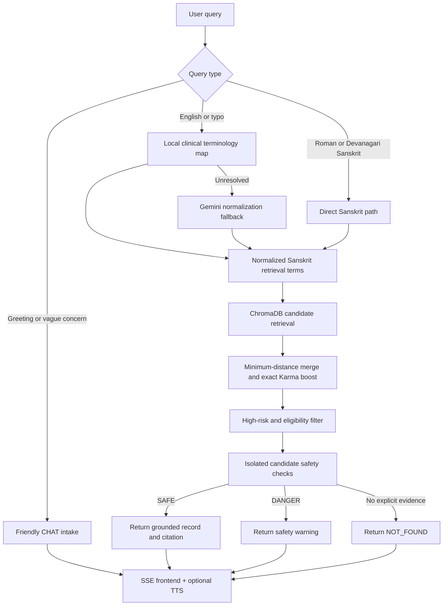

<div align="center">


# SPARSHA

### Sanskrit Pharmacology Assistant for Rational Symptom-based Herb Analysis

**A safety-gated retrieval-augmented generation system for exploring classical Ayurvedic pharmacology with traceable Sanskrit evidence.**


[Features](#key-features) · [Architecture](#architecture) · [Setup](#local-setup) · [API](#api) · [Testing](#testing-and-audit) · [Limitations](#limitations)

</div>

---

## Overview

SPARSHA is an end-to-end Ayurvedic RAG prototype that retrieves classical drug evidence from structured Nighantu records, verifies each candidate through an explicit safety gate, and returns the supporting Sanskrit text with a source citation.

The project focuses on four engineering goals:

1. **Evidence traceability** — every accepted result retains its source text and verse/record ID.
2. **Safety before generation** — no answer text is emitted until the selected record receives an explicit verdict.
3. **Low-latency retrieval** — common English, Roman Sanskrit, Devanagari, and typo variants are resolved locally when possible.
4. **Data accountability** — accepted, quarantined, raw, and high-risk records remain separately auditable.

> SPARSHA is a research and educational prototype. It is not a substitute for diagnosis, individualized treatment, or consultation with a qualified BAMS physician.

## Key features

### Retrieval and language handling

- English, Roman Sanskrit, IAST, and Devanagari query support.
- Local terminology mapping for common clinical expressions.
- Conservative typo handling, such as `jwara → ज्वर` and `bloting → bloating → आध्मान`.
- Gemini normalization only when deterministic mapping cannot resolve the query.
- Per-term ChromaDB searches merged by minimum embedding distance.
- Exact Sanskrit Karma matches prioritized over embedding-only similarity.

### Safety-gated responses

- Separate verdicts: `SAFE`, `DANGER`, `NOT_FOUND`, and non-clinical `CHAT`.
- Candidate records are verified independently rather than blended into one multi-herb context.
- Generated output is shown only after an explicit `SAFE` verdict.
- High-risk, toxic, mineral, metal, and purification-dependent records are retained for audit but excluded from ordinary recommendations.
- Data gaps produce `NOT_FOUND` instead of fabricated remedies.

### User experience

- Streaming Server-Sent Events (SSE).
- Friendly conversational intake for greetings and vague concerns.
- English and Hindi interface controls.
- Browser speech recognition.
- Persistent text-to-speech ON/OFF control.
- Responsive vanilla HTML/CSS/JavaScript frontend.

### Engineering and operations

- FastAPI backend with CORS support.
- ChromaDB persistent vector storage.
- SentenceTransformer `all-MiniLM-L6-v2` embeddings.
- Google `google-genai` SDK with Gemini Flash.
- HTTP and provider-level rate limiting.
- In-memory normalization, classification, and answer caches.
- Startup warm-loading to remove first-query model initialization latency.
- Deterministic IDs and idempotent ChromaDB upserts.
- Reproducible dataset and terminology audit scripts.

## Architecture



## Safety design

SPARSHA deliberately separates structural data quality from clinical validity.

| Layer | Purpose |
|---|---|
| Structural audit | Detects missing headwords, commentary rows, malformed records, and shifted fields |
| Eligibility metadata | Prevents quarantined and unparsed records from entering recommendation retrieval |
| High-risk quarantine | Excludes toxic and purification-dependent substances from ordinary results |
| Local explicit-action gate | Accepts only nearby Sanskrit disease/action evidence when deterministic |
| Gemini verifier | Handles ambiguous candidates using one record per classification request |
| Citation requirement | Keeps the source text and record/verse ID attached to every result |
| Data-gap behavior | Returns `NOT_FOUND` rather than inventing a treatment |

The system does not automatically populate missing English names, botanical identities, or disease translations.

## Data pipeline

### Current test corpus

| Component | Records | Runtime role |
|---|---:|---|
| Bhāvaprakāśa source rows retained | 1,110 | Structured test source |
| Structurally accepted rows | 726 | Audited before risk policy |
| High-risk/purification-dependent rows | 42 | Retained but ineligible |
| Final recommendation-eligible rows | 684 | Candidate retrieval |
| Structurally quarantined rows | 384 | Manual BAMS review |
| Rājanighaṇṭu raw cited verses | 3,676 | Source evidence; not recommendation-eligible |
| Aṣṭāṅganighaṇṭu raw cited verses | 408 | Source evidence; not recommendation-eligible |
| Total ChromaDB records | 5,194 | Searchable and auditable |

### Processing stages

```text
Original source
    ↓
Structural validation
    ↓
Accepted + review datasets
    ↓
High-risk quarantine policy
    ↓
ChromaDB ingestion
    ↓
Terminology coverage audit
    ↓
Safety-gated retrieval
```

Important scripts:

- `gretil_pipeline/prepare_bhavaprakasha.py` — validates and partitions the legacy source.
- `build_disease_lexicon.py` — builds the provisional Sanskrit/English terminology map.
- `ingest_db.py` — ingests eligible, quarantined, and raw evidence records.
- `run_system_audit.py` — generates structural and terminology coverage reports.

## Performance

Observed warm-query latency during local testing:

| Query | Path | Observed latency |
|---|---|---:|
| `Jvara` / `jwara` | Local Sanskrit mapping + explicit Karma gate | ~0.28–0.30 s |
| Repeated resolved query | In-memory answer cache | Near-immediate |
| Ambiguous query | Gemini normalization/classification fallback | Network and quota dependent |

Sub-second performance is targeted for deterministic and cached paths. Remote LLM fallbacks are intentionally not presented as guaranteed one-second operations.

## Terminology coverage

The current automated terminology audit evaluates 56 provisional clinical mappings:

- **42** terms have explicit nearby Sanskrit action evidence.
- **5** terms are mentioned but require Gemini/BAMS interpretation.
- **9** terms are documented corpus gaps and should return `NOT_FOUND`.

Detailed results are generated in:

```text
data/automated_condition_test_matrix.csv
SPARSHA_TEST_REPORT.md
```

## Repository structure

```text
SPARSHA/
├── main.py
├── ingest_db.py
├── build_disease_lexicon.py
├── run_system_audit.py
├── requirements.txt
├── .env.example
├── README.md
├── frontend/
│   ├── index.html
│   └── image-removebg-preview.png
├── data/
│   ├── Master_Ayurveda_Database_Fixed.csv
│   ├── bhavaprakasha_clean.csv
│   ├── bhavaprakasha_review.csv
│   ├── bhavaprakasha_audit.json
│   ├── clinical_term_map.json
│   ├── disease_lexicon_all.csv
│   ├── disease_lexicon_review.csv
│   └── automated_condition_test_matrix.csv
├── gretil_pipeline/
│   ├── fetch_nighantus.py
│   ├── prepare_bhavaprakasha.py
│   ├── SOURCES.md
│   └── raw_texts/
│       ├── rajanighantu.txt
│       └── ashtanga_nighantu.txt
└── ayurveda_vector_db/        # generated locally; excluded from Git
```

## Local setup

### 1. Clone the repository

```bash
git clone https://github.com/Devesh-tiw/SPARSHA.git
cd SPARSHA
```

### 2. Create a virtual environment

```bash
python3 -m venv venv
source venv/bin/activate
python -m pip install --upgrade pip
python -m pip install -r requirements.txt
```

### 3. Configure environment variables

```bash
cp .env.example .env
```

Add your Google AI Studio key to `.env`:

```env
GEMINI_API_KEY=your_actual_key
GEMINI_MODEL=gemini-3.6-flash
CHROMA_PERSIST_PATH=./ayurveda_vector_db
CHROMA_COLLECTION=sparsha_collection
EMBEDDING_MODEL=all-MiniLM-L6-v2
RETRIEVAL_POOL=40
MAX_CLASSIFY_CANDIDATES=5
CLASSIFY_CONCURRENCY=5
DETERMINISTIC_OUTPUT=true
RATE_LIMIT_REQUESTS=12
RATE_LIMIT_WINDOW_SECONDS=60
GEMINI_RATE_LIMIT_CALLS=12
```

Never commit `.env` or expose the key in frontend code.

### 4. Prepare the datasets

```bash
python gretil_pipeline/prepare_bhavaprakasha.py
python build_disease_lexicon.py
```

### 5. Build ChromaDB

```bash
python ingest_db.py --reset
```

Expected summary:

```text
Recommendation-eligible Bhavaprakasha entries: 684
High-risk/purification-dependent entries quarantined: 42
Structurally quarantined Bhavaprakasha rows retained: 384
Raw GRETIL source verses retained: 4084
Total collection records: 5194
```

### 6. Run the audit

```bash
python run_system_audit.py
```

### 7. Start the application

```bash
uvicorn main:app --reload --host 127.0.0.1 --port 8000
```

Open:

- Application: `http://127.0.0.1:8000`
- Health endpoint: `http://127.0.0.1:8000/health`

## API

### Query endpoint

```http
POST /ask
Content-Type: application/json
```

```json
{
  "symptom": "jwara",
  "language": "sa"
}
```

### SSE response

```text
data: {"status":"SAFE","reasoning":"Raw Karma contains an explicit nearby disease-removing action.","latency_seconds":0.29}

data: {"text":"Herb Sanskrit: ...\nRaw karma Sanskrit: ...\nSource verse IDs: BPN_..."}

data: [DONE]
```

Other endpoints:

```text
GET  /health
POST /api/query
GET  /api/query?q=Jvara
```

## Testing and audit

Run the automated source-level audit:

```bash
python run_system_audit.py
```

Recommended manual smoke tests:

| Input | Expected behavior |
|---|---|
| `hello` | Friendly `CHAT`, no medical verdict |
| `jwara` / `fever` / `ज्वर` | Consistent Sanskrit routing and cited evidence |
| `kasa` / `cough` / `कास` | Explicit cough-related evidence or safe refusal |
| `my stmuch is bloting` | Conservative typo correction to `आध्मान` |
| `headache` / `शिरःशूल` | `NOT_FOUND` because of a documented data gap |
| Unknown condition | Clarification or `NOT_FOUND`; never fabricated evidence |

A result passes only when:

- The status is appropriate.
- The selected record is eligible.
- The Karma supports the condition.
- The source citation exists.
- No missing English or botanical value is invented.

## Engineering decisions

### Why deterministic mapping before Gemini?

It reduces latency, cost, quota usage, and translation variance for known terminology.

### Why one-record-at-a-time verification?

It prevents the verifier from mixing properties or contraindications across different substances.

### Why keep quarantined data?

Removing uncertain data destroys auditability. SPARSHA stores it with metadata while preventing it from entering ordinary recommendations.

### Why return the verified record directly?

For deterministic paths, returning the schema-formatted source avoids a second LLM rewrite and minimizes hallucination risk.

## Limitations

- The English terminology map is provisional and requires BAMS approval.
- Structural acceptance is not proof of clinical correctness.
- Several classical terms do not have one-to-one biomedical equivalents.
- The current test corpus has documented gaps, including `शिरःशूल`, `मधुमेह`, `आमवात`, and `वातरक्त`.
- The sandhi-aware parser remains incomplete.
- Gemini fallback latency and availability depend on network access, quota, and model availability.
- The application does not provide dosage, individualized prescriptions, or emergency diagnosis.

## Roadmap

- [ ] BAMS review workflow for terminology and quarantined records
- [ ] Sandhi-aware Sanskrit preprocessing
- [ ] Expert-labelled clinical gold test set
- [ ] Precision, recall, false-SAFE, and citation-correctness metrics
- [ ] Persistent cache for multi-process deployment
- [ ] Structured matched-evidence highlighting
- [ ] Authorized NIIMH/CCRAS terminology integration
- [ ] Containerized deployment and automated CI tests

## Data and licensing

- GRETIL source files retain their original licence notices; the included files identify **CC BY-NC-SA 4.0** terms.
- The legacy professor dataset is included for testing and requires independent permission before production or commercial use.
- Code and dataset licensing must be handled separately.
- Do not remove source attribution, verse identifiers, audit metadata, or safety labels.

## Responsible-use notice

SPARSHA is intended to support structured exploration of classical Ayurvedic literature. A fluent response is not proof of safety or efficacy. Clinical decisions must remain with appropriately qualified professionals using complete patient assessment and authorized reference material.

---

<div align="center">

**SPARSHA — classical evidence, explicit safety gates, traceable results.**

</div>
